# 📱 Pedie Business Plan*Note: The 2.5% reserve figure is adequate assuming a ~5% claim rate with ~20% requiring independent inspection (≈KES 7.5/unit average inspection cost at Pedie's 50% share of KES 1,500) plus replacement/repair subsidies. Unit economics (Section 6.2) now reflects this reserve consistently.*

## Premium Refurbished Electronics — Import & Resale

<div align="center">


**"Your Trusted Tech Peddler"**

</div>

---

|                    |                                      |
| ------------------ | ------------------------------------ |
| **Company Name**   | Pedie                                |
| **Legal Entity**   | Sole Trader _(registration pending)_ |
| **Founder**        | Vikshan                              |
| **Location**       | Nairobi, Kenya                       |
| **Industry**       | Consumer Electronics (Refurbished)   |
| **Business Model** | Direct Import + Local Resale         |
| **Website**        | [pedie.tech](https://pedie.tech)     |
| **Date**           | February 2026                        |

---

## 📋 Table of Contents

- [Executive Summary](#-executive-summary)
- [1. Company Description](#1-company-description)
- [2. Market Analysis](#2-market-analysis)
- [3. Products & Services](#3-products--services)
- [4. Operations Plan](#4-operations-plan)
- [5. Marketing & Sales Strategy](#5-marketing--sales-strategy)
- [6. Financial Projections](#6-financial-projections)
- [7. Terms & Policies](#7-terms--policies)
- [8. Risk Analysis](#8-risk-analysis)
- [9. Implementation Timeline](#9-implementation-timeline)
- [10. Management & Organization](#10-management--organization)
- [11. Funding Request](#11-funding-request)
- [12. Appendix](#12-appendix)

---

## 🎯 Executive Summary

### The Opportunity

Kenyans seeking affordable premium electronics face a difficult choice: pay inflated prices at established retailers, or risk counterfeit goods from grey markets. **Pedie** bridges this gap by importing certified refurbished devices from trusted US marketplaces and delivering them with full transparency, fair pricing, and genuine after-sales support.

### Business Model at a Glance

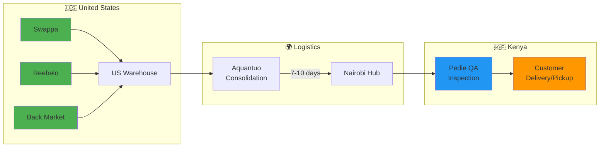

### Key Metrics

| Metric                    | Target      |
| ------------------------- | ----------- |
| **Year 1 Revenue**        | KES 21M+    |
| **Net Profit Margin**     | 18–25%      |
| **Monthly Volume**        | 25–35 units |
| **Customer Satisfaction** | 95%+        |
| **Delivery Time**         | 7–10 days   |

### Why "Pedie"?

> **Pedie** comes from the Swahili slang _"pedi"_ meaning "peddler" — but not just any seller. In Kenya, your _pedi_ is someone you trust completely. A "milk pedi" is your trusted milk seller; you defend their quality religiously.

Pedie represents:

| Value              | Meaning                                            |
| ------------------ | -------------------------------------------------- |
| 🤝 **Trust**       | Certified refurbished devices, never counterfeit   |
| 💎 **Quality**     | Premium devices at fair, transparent prices        |
| 🔄 **Loyalty**     | Long-term relationships, not one-time transactions |
| 📞 **Reliability** | Clear communication, honest warranty terms         |

---

## 1. Company Description

### 1.1 Mission Statement

> To democratize access to premium technology in Kenya by providing certified refurbished devices at fair prices, backed by transparent policies and genuine customer care.

### 1.2 Vision Statement

> To become East Africa's most trusted source for refurbished electronics, proving that quality and affordability can coexist.

### 1.3 The Problem

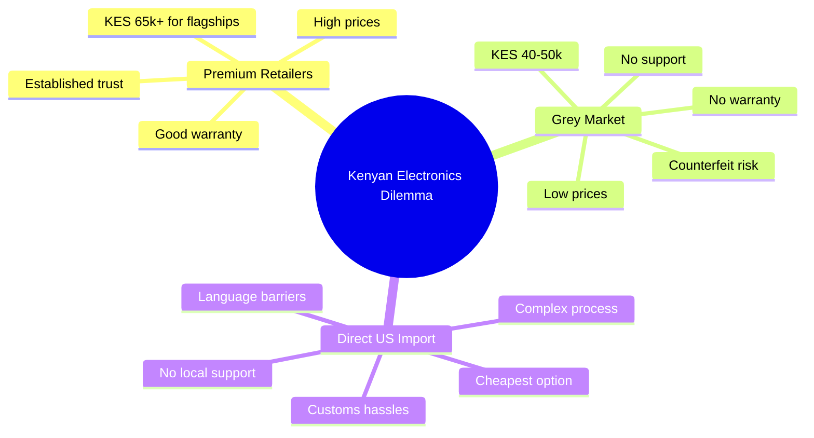

**The Gap:** No trusted, transparent importer offering certified refurbished devices at fair prices with proper after-sales support.

### 1.4 The Solution

Pedie solves this through:

1. **🔍 Trusted Sourcing** — Only certified refurbished from Swappa, Reebelo, Back Market
2. **✈️ Direct Import** — Via Aquantuo with transparent 7-10 day timelines
3. **💰 Fair Pricing** — up to ~17% (approximately 11–17%) below premium retailers like Badili
4. **🛡️ 3-Month Warranty** — Covers manufacturing defects
5. **📱 Personal QA** — Founder personally inspects every unit
6. **💬 Transparent Communication** — Honest about timelines, conditions, policies

### 1.5 Business Model

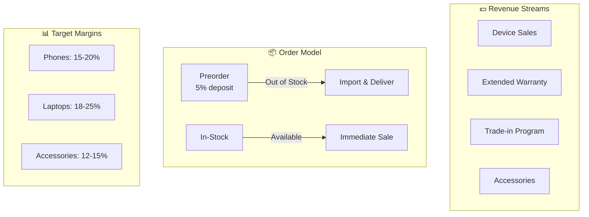

**Key Operational Features:**

| Feature                      | Benefit                                    |
| ---------------------------- | ------------------------------------------ |
| **Preorder Model**           | No upfront inventory costs                 |
| **5% Deposit**               | Covers import costs, reduces cancellations |
| **Consolidation Shipping**   | Reduces per-unit shipping costs            |
| **Flexible Pickup/Delivery** | Customer chooses convenience               |

---

## 2. Market Analysis

### 2.1 Market Overview

**Kenya Electronics Market:**

- 🌍 Kenya imports ~70% of all electronics
- 📈 Growing middle class with disposable income
- 📱 Smartphone penetration: ~50% (upgrade cycle opportunity)
- 💻 Laptop demand rising: Remote work, students, professionals

### 2.2 Target Market Segments

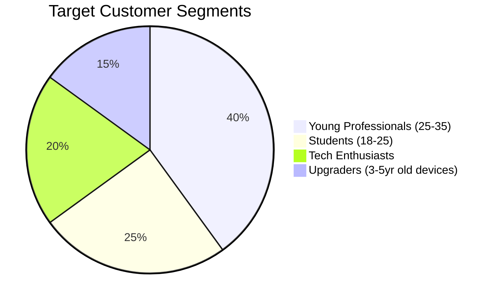

| Segment                 | Age   | Needs                                       | Price Sensitivity |
| ----------------------- | ----- | ------------------------------------------- | ----------------- |
| **Young Professionals** | 25-35 | Premium devices, reliability                | Medium            |
| **Students**            | 18-25 | Durability, value for money                 | High              |
| **Tech Enthusiasts**    | 20-40 | Latest features, willing to try refurbished | Low               |
| **Upgraders**           | 25-45 | Replacement for aging device                | Medium            |

### 2.3 Competitive Landscape

| Competitor            | Position          | Pricing (iPhone 12 PM) | Warranty     | Weakness         |
| --------------------- | ----------------- | ---------------------- | ------------ | ---------------- |
| **Badili Kenya**      | Premium           | KES 65,000             | 12 months    | High prices      |
| **Phone Place Kenya** | Mid-tier          | KES 58,500             | Unclear      | Poor after-sales |
| **Veracity World**    | Premium           | KES 60,000+            | Variable     | Limited stock    |
| **JiJi/Jumia**        | Grey market       | KES 40,000-50,000      | None         | Counterfeit risk |
| **Pedie**             | **Trust + Value** | **KES 58,000**         | **3 months** | New brand        |

### 2.4 Competitive Advantages

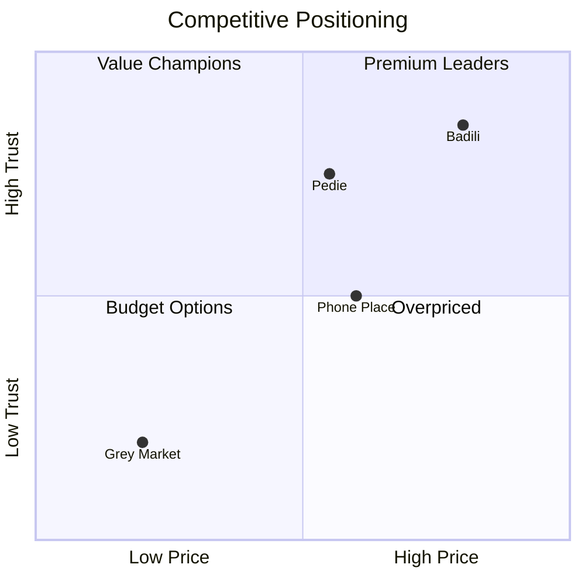

**Pedie's Competitive Edge:**

- ✅ Certified sources (not grey market)
- ✅ Trust + transparency at fair prices (comparable to mid-tier, up to ~17% (approximately 11-17%) below premium retailers like Badili)
- ✅ Personal quality inspection by founder
- ✅ Transparent 7-10 day timeline
- ✅ Clear 3-month warranty (better than grey market/unclear competitors)
- ✅ Founder-led customer service

### 2.5 SWOT Analysis

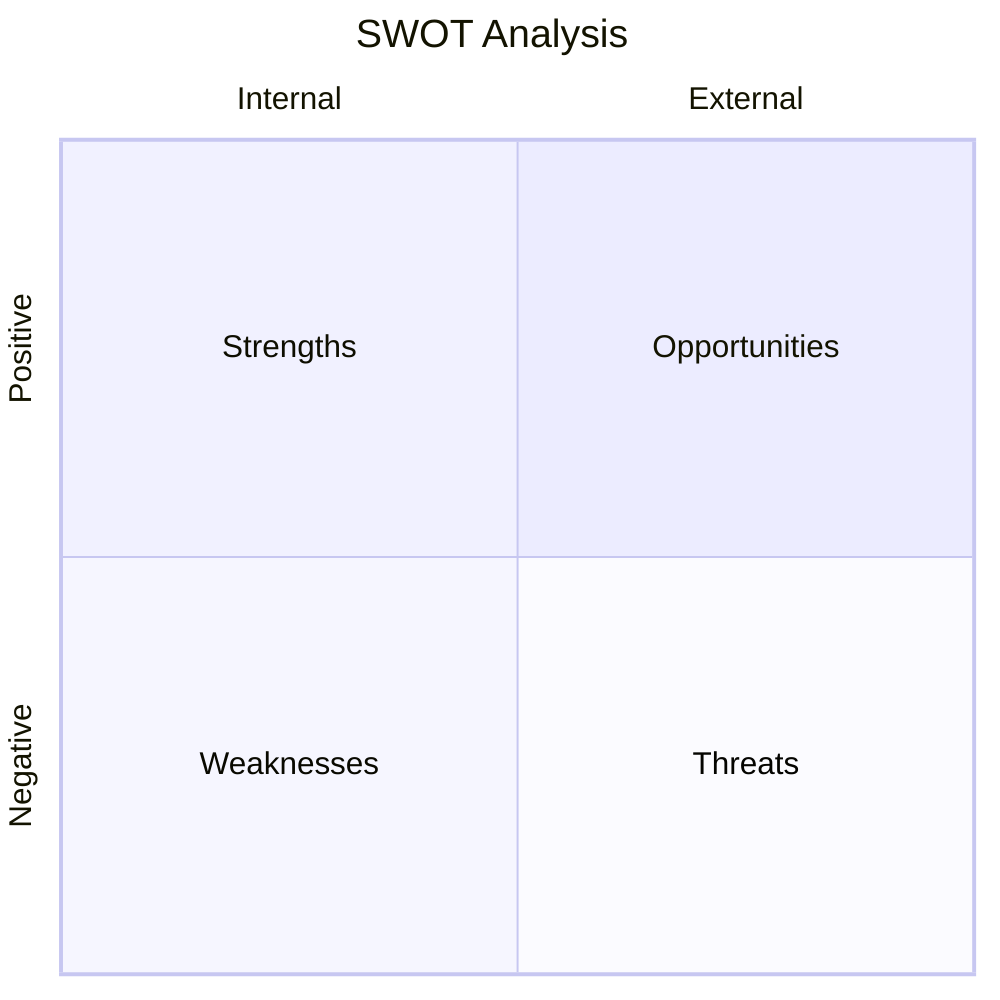

| Strengths                           | Weaknesses                                      |
| ----------------------------------- | ----------------------------------------------- |
| ✅ Trusted US suppliers             | ⚠️ New brand, no track record                   |
| ✅ Capital-efficient preorder model | ⚠️ Limited warranty vs. Badili (3 vs 12 months) |
| ✅ Personal QA by founder           | ⚠️ Solo operation (scalability)                 |
| ✅ Transparent pricing & timelines  | ⚠️ Dependent on USD/KES exchange rate           |

| Opportunities                                 | Threats                         |
| --------------------------------------------- | ------------------------------- |
| 📈 Growing demand for affordable premium tech | ⚡ Competitors may lower prices |
| 📈 Underserved market segment                 | ⚡ Currency fluctuations        |
| 📈 Expansion to tablets, accessories          | ⚡ Regulatory changes (KEBS)    |
| 📈 Regional expansion (Mombasa, Kisumu)       | ⚡ Shipping delays/damages      |

---

## 3. Products & Services

### 3.1 Product Categories

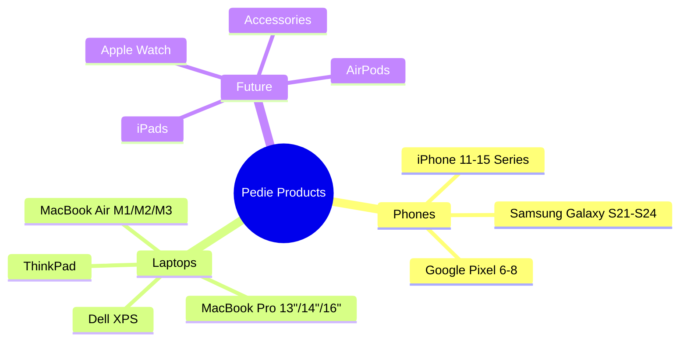

### 3.2 Product Phasing Strategy

| Phase       | Timeline   | Products                               | Focus                         |
| ----------- | ---------- | -------------------------------------- | ----------------------------- |
| **Phase 1** | Month 1-3  | iPhone 11-14, MacBook Air M1/M2        | Core products, validate model |
| **Phase 2** | Month 4-6  | + Samsung Galaxy, iPad, Dell XPS       | Android option, diversify     |
| **Phase 3** | Month 7-12 | + Accessories, Watches, Gaming Laptops | Category expansion            |

### 3.3 Product Selection Criteria

All products must meet:

- ✅ **Certified Refurbished** — Not just "used"
- ✅ **Unlocked** — Carrier-free, works with all networks
- ✅ **Battery Health** — Minimum 80% capacity
- ✅ **Cosmetic Grade** — A/B grade (minimal visible wear)
- ✅ **Complete Package** — Original or quality accessories included
- ✅ **Software Ready** — Latest OS compatible

### 3.4 Pricing Strategy

**Philosophy:** Trust + transparency at fair prices—comparable to mid-tier competitors, up to ~17% (approximately 11-17%) below premium retailers like Badili, and 14-29% above grey market.
| Product | US Cost | Landed Cost | Selling Price | Gross Margin\* |
| ------------------------- | ------- | ----------- | ------------- | -------------- |
| iPhone 11 (64GB) | $199 | KES 30,370 | KES 40,000 | 24% |
| iPhone 12 (128GB) | $249 | KES 36,870 | KES 50,000 | 26% |
| iPhone 12 Pro Max (256GB) | $299 | KES 43,420 | KES 58,000 | 25% |
| iPhone 13 Pro (256GB) | $369 | KES 52,520 | KES 68,000 | 23% |
| iPhone 14 (128GB) | $599 | KES 82,420 | KES 95,000 | 13% |
| MacBook Air M1 (256GB) | $699 | KES 95,420 | KES 120,000 | 20% |
| MacBook Air M2 (256GB) | $899 | KES 121,420 | KES 145,000 | 16% |

_\*Gross Margin = (Selling Price - Landed Cost) / Selling Price. Excludes operating expenses (delivery, packaging, payment processing, warranty reserves). See Section 6.2 for a per-unit example (iPhone 12 Pro Max) net margin after operating costs (~18%), not the Year 1 P&L net profit figure. Landed cost includes product + $35 Aquantuo shipping @ KES 130/USD (rate as of 2026-02-07; baseline for forecasts). See Section 8.2 Currency Management Protocol for repricing triggers and review cadence._

#### Supplier Cost Sensitivity Analysis

Pedie sources from multiple US refurbishers. Costs vary by supplier:

| Supplier             | Landed Cost (iPhone 12 PM) | Gross Margin | Margin Delta |
| -------------------- | -------------------------- | ------------ | ------------ |
| **Swappa (Primary)** | KES 43,420                 | 25%          | Baseline     |
| Reebelo (Backup)     | KES 46,800                 | 19%          | -6pp         |
| Back Market (Backup) | KES 48,750                 | 16%          | -9pp         |

> ⚠️ **Risk Mitigation:** Swappa is the primary supplier due to best pricing. Reebelo and Back Market serve as backups for stockouts. When sourcing from higher-cost suppliers, either (a) adjust product-level pricing, (b) absorb temporarily using the 10-15% pricing buffer, or (c) decline the order if margin falls below 10%.

---

## 4. Operations Plan

### 4.1 Supply Chain

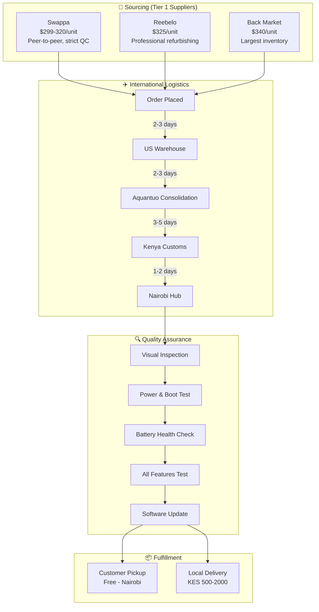

### 4.2 Supplier Criteria

| Requirement              | Why                                       |
| ------------------------ | ----------------------------------------- |
| ✅ Certified Refurbished | Not just "used" — professionally restored |
| ✅ Unlocked Devices      | Works on all Kenyan carriers              |
| ✅ Free US Shipping      | Reduces overall cost                      |
| ✅ Buyer Protection      | Recourse if item is defective             |
| ✅ Quality Ratings       | Only 4.5+ star sellers                    |

### 4.3 Quality Assurance Checklist

Every device undergoes founder-led inspection:

```
┌─────────────────────────────────────────────────────────────┐
│                 PEDIE QA INSPECTION CHECKLIST               │
├─────────────────────────────────────────────────────────────┤
│ □ 1. Packaging intact, no transit damage                    │
│ □ 2. Visual: Screen, body, buttons, camera lens             │
│ □ 3. Power on: Boot time, no error messages                 │
│ □ 4. Battery health: iOS ≥80%, Android check                │
│ □ 5. Ports: Charging, headphone jack (if applicable)        │
│ □ 6. Camera: Photo, video, all modes                        │
│ □ 7. Audio: Speakers, microphone, call quality              │
│ □ 8. Biometrics: Face ID / Touch ID / Fingerprint           │
│ □ 9. Connectivity: WiFi, Bluetooth, Cellular                │
│ □ 10. Software: Latest OS installable                       │
├─────────────────────────────────────────────────────────────┤
│ RESULT: □ PASS  □ FAIL (Reason: ___________________)        │
└─────────────────────────────────────────────────────────────┘
```

### 4.4 Shipping & Logistics

**International (US → Kenya):**

| Carrier                | Cost (Single) | Cost (Bulk 10+) | Timeline   |
| ---------------------- | ------------- | --------------- | ---------- |
| **Aquantuo** (Primary) | $35/unit      | $25-27/unit     | 7-10 days  |
| **Kentex** (Backup)    | $40/unit      | $30/unit        | 10-14 days |

**Local Delivery (Kenya):**

| Region             | Cost            | Carriers      |
| ------------------ | --------------- | ------------- |
| Nairobi (Pickup)   | Free            | —             |
| Nairobi (Delivery) | KES 500-800     | Pesa Box, G&G |
| Central Kenya      | KES 1,000-1,500 | G&G Logistics |
| Coastal (Mombasa)  | KES 1,500-2,000 | Jambopay      |
| Western Kenya      | KES 1,500-2,000 | G&G, Pesa Box |

### 4.5 Inventory Management

**Phase 1-3 (Month 1-6):** Preorder-based, manual tracking

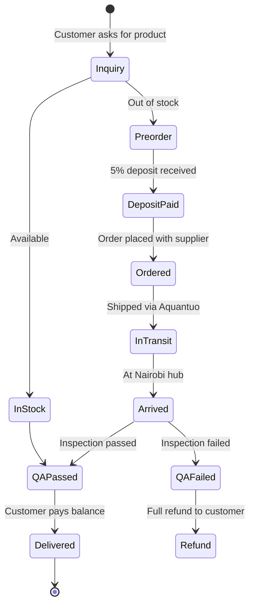

**Phase 4+ (Month 7+):** Odoo Inventory Module

- Auto-track stock levels
- Reorder alerts
- SKU management
- Warranty tracking

---

## 5. Marketing & Sales Strategy

### 5.1 Marketing Funnel

> 💡 _Note: The funnel chart below requires Mermaid v9.3+. If your renderer doesn't support it, see the table below._

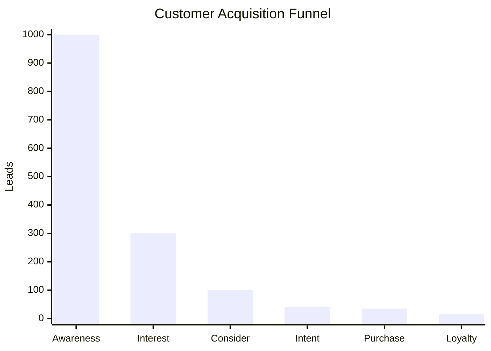

**Funnel Breakdown:**

| Stage         | Volume | Conversion | Description                 |
| ------------- | ------ | ---------- | --------------------------- |
| Awareness     | 1,000  | -          | Social media, ads reach     |
| Interest      | 300    | 30%        | Website visits              |
| Consideration | 100    | 33%        | Inquiries via WhatsApp/chat |
| Intent        | 40     | 40%        | Deposit paid                |
| Purchase      | 35     | 88%        | Order completed             |
| Loyalty       | 15     | 43%        | Repeat/referral customers   |

### 5.2 Go-to-Market Phases

| Phase                 | Timeline   | Channels                                     | Budget     | Goal                 |
| --------------------- | ---------- | -------------------------------------------- | ---------- | -------------------- |
| **1. Soft Launch**    | Month 1-3  | WhatsApp, Personal Network, Facebook Friends | Free       | 5-10 sales, validate |
| **2. Digital Growth** | Month 4-6  | Google Ads, Facebook/IG Ads, Tech Bloggers   | KES 15k/mo | 15-20 sales/month    |
| **3. Brand Building** | Month 7-12 | SEO, Email, Loyalty Program, Events          | KES 30k/mo | 30-50 sales/month    |

### 5.3 Marketing Channels

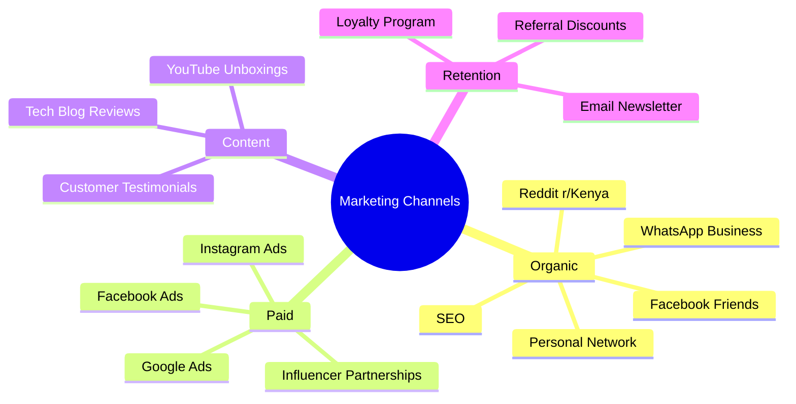

### 5.4 Sales Channels

**Primary: Online Store (Odoo eCommerce)**

- Product catalog with specs, photos, pricing
- Preorder system with M-Pesa deposit collection
- Shipping calculator
- Customer reviews section
- FAQ (warranty, returns, shipping)

**Secondary: WhatsApp Business**

- Direct inquiries and quotes
- Order confirmation and tracking
- Customer support

**Tertiary: Social Media**

- Facebook Marketplace listings
- Instagram product showcases

### 5.5 Brand Messaging

**Tagline:** _"Your Trusted Tech Peddler"_

**Key Messages:**

| Audience Pain Point      | Pedie Message                                                                 |
| ------------------------ | ----------------------------------------------------------------------------- |
| "Is it fake?"            | "Certified refurbished from Swappa, Reebelo, Back Market — never grey market" |
| "Too expensive"          | "10% cheaper than Badili, same quality"                                       |
| "What if it breaks?"     | "3-month warranty covers defects, no hassle"                                  |
| "How long will it take?" | "7-10 days, transparent tracking"                                             |
| "Can I trust you?"       | "Personal inspection by founder, real customer testimonials"                  |

---

## 6. Financial Projections

### 6.1 Startup Costs

| Category       | Item                            | Cost (KES)      |
| -------------- | ------------------------------- | --------------- |
| **Technology** | Odoo hosting (1 year)           | 15,000          |
|                | Domain + email                  | 5,000           |
| **Legal**      | Business registration           | 15,000          |
| **Marketing**  | Logo, materials, business cards | 20,000          |
| **Inventory**  | Initial test units (3-5)        | 200,000         |
| **Insurance**  | Product liability (1 year)      | 25,000          |
| **Operations** | Packaging supplies              | 15,000          |
| **Reserve**    | Buffer (10%)                    | 30,000          |
|                | **TOTAL**                       | **KES 325,000** |

> ⚠️ **Working Capital Reality Check:**
>
> The preorder deposit model with tiered rates (phones 5%, laptops 10%) reduces but does not eliminate capital requirements:
>
> **Q1 Working Capital Gap:**
>
> - Projected Q1 volume: 30 phones + 8 laptops = 38 units
> - Avg. landed cost: **KES 45,000/unit**  
>   _Blended planning average across the Q1 mix (30 phones, 8 laptops), assuming phones skew to iPhone 11 (KES 30,370) and iPhone 12 (KES 36,870) landed costs and laptops skew to MacBook Air M1 landed cost (KES 95,420) from Section 3.4._
>
>   <details>
>   <summary>📊 Blended cost derivation</summary>
>   - Phone avg landed (50% iPhone 11 + 50% iPhone 12): (30,370 + 36,870) / 2 = **KES 33,620**
>   - Laptop landed (MacBook Air M1): **KES 95,420**
>   - Q1 weighted avg: (30 × 33,620 + 8 × 95,420) / 38 = **KES 46,630**
>   - **KES 45,000** is a conservative planning round-down (~3% buffer)
>
>   </details>
>
> - **Tiered deposit collection** (based on selling prices per Section 7.1):
>   - Phones: 30 units × 5% × KES 58,000 (avg selling price) = KES 87,000
>   - Laptops: 8 units × 10% × KES 132,500 (midpoint of MacBook Air M1 KES 120,000 and M2 KES 145,000: (120,000 + 145,000) / 2 = KES 132,500) = KES 106,000
>   - **Total deposits: KES 193,000** (~KES 5,100 per unit)
>   - Deposit coverage: ~11.3% of total landed cost
>   - Pedie fronts per unit: ~KES 39,900
> - Working capital needed:
>   - Total landed cost: 38 × KES 45,000 = **KES 1.71M**
>   - Minus deposits: KES 193,000
>   - **Net: ~KES 1.52M**
> - Startup budget: KES 325,000
> - **Shortfall: ~KES 1.19M**
>
> **Mitigation:** Batch orders to match available capital, start with 3-5 units, reinvest profits, or seek short-term trade financing. See **Section 11.1** for canonical working-capital figures and detailed funding scenarios.

### 6.2 Unit Economics

**Example: iPhone 12 Pro Max 256GB**

```
┌─────────────────────────────────────────────────────────────┐
│               UNIT ECONOMICS BREAKDOWN                       │
├─────────────────────────────────────────────────────────────┤
│ SELLING PRICE                              KES 58,000       │
├─────────────────────────────────────────────────────────────┤
│ COSTS:                                                       │
│   Product (Swappa @ $299)                  KES 38,870       │
│   Shipping (Aquantuo @ $35)                KES  4,550       │
│   ─────────────────────────────────────────────────────     │
│   Landed Cost                              KES 43,420       │
│                                                              │
│   Local delivery support                   KES    500       │
│   Packaging materials                      KES    650       │
│   Payment processing (3%)                  KES  1,740       │
│   Warranty reserve (2.5%)                  KES  1,450       │
│   ─────────────────────────────────────────────────────     │
│   Total Costs                              KES 47,760       │
├─────────────────────────────────────────────────────────────┤
│ NET PROFIT PER UNIT                        KES 10,240 (18%) │
└─────────────────────────────────────────────────────────────┘
```

### 6.3 Revenue Projections (Year 1)

| Quarter      | Phones  | Laptops | Revenue       | Cumulative |
| ------------ | ------- | ------- | ------------- | ---------- |
| Q1 (M1-3)    | 30      | 8       | KES 2.7M      | KES 2.7M   |
| Q2 (M4-6)    | 50      | 12      | KES 4.4M      | KES 7.1M   |
| Q3 (M7-9)    | 70      | 18      | KES 6.2M      | KES 13.3M  |
| Q4 (M10-12)  | 90      | 24      | KES 8.1M      | KES 21.4M  |
| **TOTAL Y1** | **240** | **62**  | **KES 21.4M** |            |

### 6.4 Profit & Loss Projection (Year 1)

| Line Item                        | Amount (KES)            |
| -------------------------------- | ----------------------- |
| **Revenue**                      |                         |
| Phone Sales (240 × KES 58k avg)  | 13,920,000              |
| Laptop Sales (62 × KES 125k avg) | 7,750,000               |
| **Total Revenue**                | **21,670,000**          |
|                                  |                         |
| **Cost of Goods Sold**           |                         |
| Product Costs (~52%)             | 11,270,000              |
| Shipping (~8%)                   | 1,730,000               |
| **Total COGS**                   | **13,000,000**          |
|                                  |                         |
| **Gross Profit**                 | **8,670,000 (40%)**     |
|                                  |                         |
| **Operating Expenses**           |                         |
| Hosting & Domain                 | 20,000                  |
| Marketing                        | 200,000                 |
| Insurance                        | 25,000                  |
| Packaging & Logistics            | 80,000                  |
| Payment Processing               | 650,000                 |
| Miscellaneous                    | 50,000                  |
| **Total OpEx**                   | **1,025,000**           |
|                                  |                         |
| **NET PROFIT**                   | **KES 7,645,000 (35%)** |

### 6.5 Break-Even Analysis

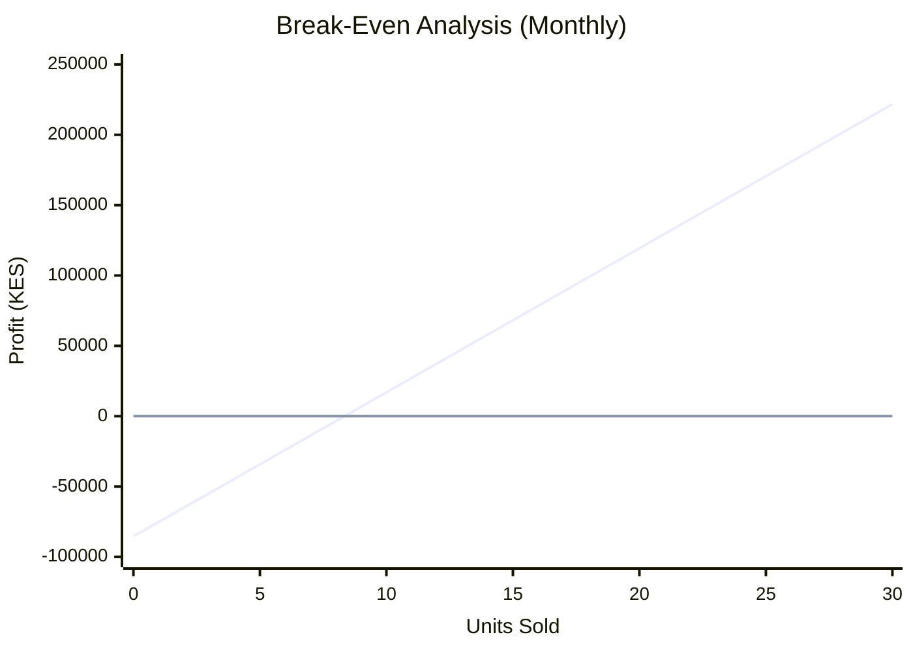

**Fixed Monthly Costs:** KES 85,417 (annual OpEx KES 1,025,000 ÷ 12)  
**Profit per Unit:** KES 10,240  
**Break-Even:** **9 units/month** ✅

_Note: Break-even = Fixed Costs ÷ Profit per Unit = 85,417 ÷ 10,240 = 8.34 → 9 units_

### 6.6 Cash Flow Model

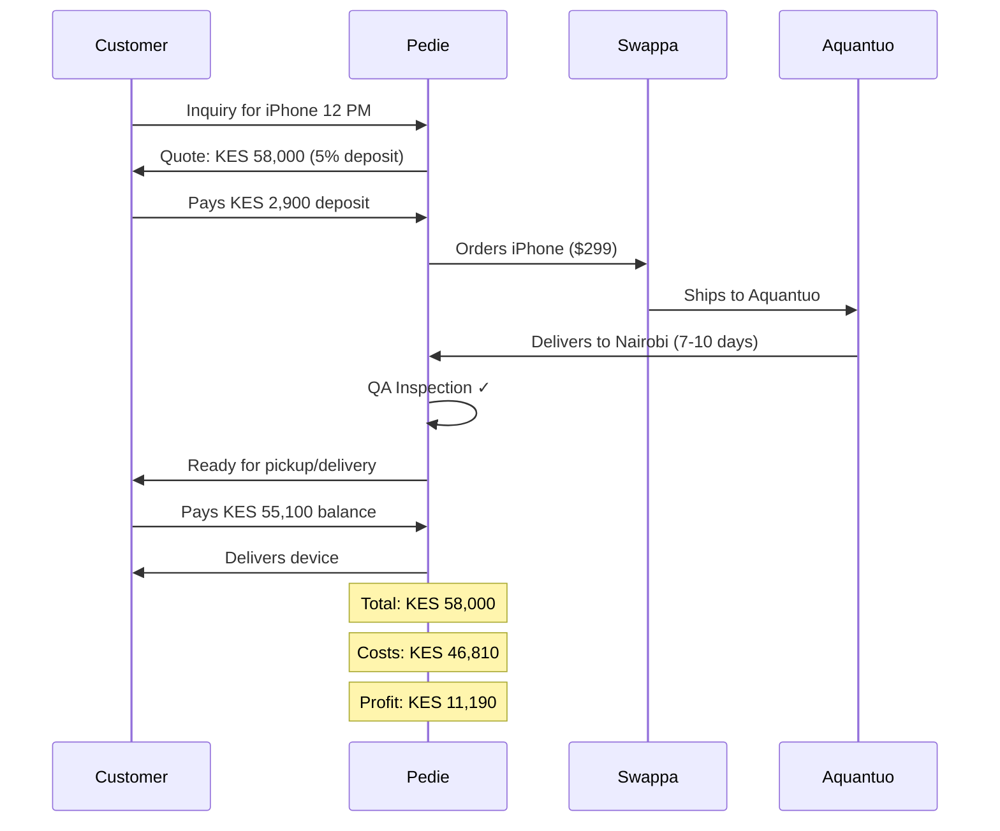

---

## 7. Terms & Policies

### 7.1 Preorder & Deposit Policy

**For Out-of-Stock Items:**

| Stage          | Customer Action                | Refund Policy                      |
| -------------- | ------------------------------ | ---------------------------------- |
| **Inquiry**    | Asks about product             | No commitment                      |
| **Deposit**    | Pays deposit (see tiers below) | Refundable if Pedie hasn't ordered |
| **Ordered**    | Pedie places supplier order    | Deposit non-refundable             |
| **In Transit** | Product shipping               | Deposit non-refundable             |
| **Delivered**  | Pays remaining balance         | Full refund if defective           |

**Deposit Tiers:**

To better manage working capital on higher-value orders, deposits are tiered by sale price:

| Sale Price   | Deposit Rate | Example                               |
| ------------ | ------------ | ------------------------------------- |
| < KES 70,000 | 5%           | KES 58k iPhone = KES 2,900 deposit    |
| ≥ KES 70,000 | 10%          | KES 120k MacBook = KES 12,000 deposit |

**For In-Stock Items:**

- No deposit required
- Pay full price, receive immediately

### 7.2 Warranty Policy

**3-Month Limited Warranty**

| Covered ✅                           | NOT Covered ❌                          |
| ------------------------------------ | --------------------------------------- |
| Manufacturing defects                | Physical damage (drops, water)          |
| Battery issues (if <70% at purchase) | Cosmetic wear (scratches, dents)        |
| Hardware malfunction                 | Software issues from user modifications |
| Non-functional ports/speakers        | Battery degradation >10% (normal)       |
| Face ID / Touch ID failures          |                                         |

**Warranty Reserve Recommendation:**

Budget 2-3% of sale price per unit for warranty claims. The 2.5% reserve covers:

- (a) Replacement device costs (from buffer inventory or next supplier batch)
- (b) Independent inspection costs (~KES 750 per disputed claim — Pedie's 50% share of the KES 1,500 inspection fee; see "Independent Inspection" below)
- (c) Repair subsidies/discounts (20% off market rate for denied claims, as noted under "Resolution")

| Product        | Sale Price  | Reserve (2.5%) |
| -------------- | ----------- | -------------- |
| iPhone 12 PM   | KES 58,000  | KES 1,450      |
| MacBook Air M1 | KES 120,000 | KES 3,000      |

_Note: The 2.5% reserve figure is adequate assuming a ~5% claim rate with ~20% requiring independent inspection (≈KES 150/unit average inspection cost at Pedie's 50% share of KES 1,500) plus replacement/repair subsidies. Unit economics (Section 6.2) now reflects this reserve consistently._

**Battery Testing Procedures:**

| Device  | Testing Method                                 | Criteria              |
| ------- | ---------------------------------------------- | --------------------- |
| iOS     | Settings → Battery → Battery Health            | ≥80% Maximum Capacity |
| Android | AccuBattery app (install, charge cycle)        | ≥80% Design Capacity  |
| Backup  | Professional battery tester (e.g., ChargerLAB) | Cost: KES 15-25k      |

**Warranty Process:**

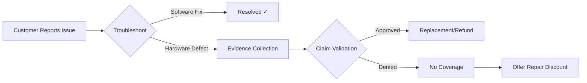

**Claim Validation Workflow:**

1. **Evidence Collection:**
   - Customer provides photos of defect (minimum 3 angles)
   - Video demonstrating issue (for intermittent problems)
   - Screenshot of battery health (for battery claims)

2. **Initial Review (by Pedie):**
   - Compare against original QA photos from purchase
   - Check for signs of physical damage not present at sale
   - Verify warranty period hasn't expired

3. **Independent Inspection (if disputed or high-value):**
   - Third-party tech repair shop inspection
   - Inspector: Authorized service center or trusted repair partner
   - Cost: **Always split 50/50** — customer pays KES 750, Pedie pays KES 750 (total KES 1,500)
   - Criteria: Written report on defect cause (manufacturing vs. user damage)

4. **Resolution:**
   - Approved: Replacement from inventory or refund
   - Denied: Written explanation + repair discount offer (20% off market rate)

**Replacement Sourcing Policy:**

- **Primary:** Maintain 2-3 unit buffer inventory of popular models for quick replacement
- **Secondary:** Source replacement from active supplier orders (add to next batch)
- **Partner Agreement:** Establish relationship with 1-2 local repair shops for:
  - Independent inspections (~KES 1,500/inspection; cost split 50/50 with customer)
  - Repair services when replacement not available
  - Formalize as "Pedie Authorized Service Partner"

### 7.3 Return & Refund Policy

| Scenario                 | Timeline        | Policy                             |
| ------------------------ | --------------- | ---------------------------------- |
| **Buyer's Remorse**      | Within 7 days   | Refund minus 2.5% restocking fee   |
| **Damaged on Arrival**   | Immediate       | Full refund, no questions          |
| **Defective (Warranty)** | Within 3 months | Full replacement or refund         |
| **Customer Damage**      | Any time        | No refund, repair discount offered |
| **After 7 Days**         | 7+ days         | No returns (warranty claims only)  |

### 7.4 Dispute Resolution

1. Customer contacts Pedie within 5 days of issue
2. Evidence review (photos/videos)
3. If disputed: Third-party tech expert inspection
4. Expert decision is final
5. Resolution within 14 days

---

## 8. Risk Analysis

### 8.1 Risk Matrix

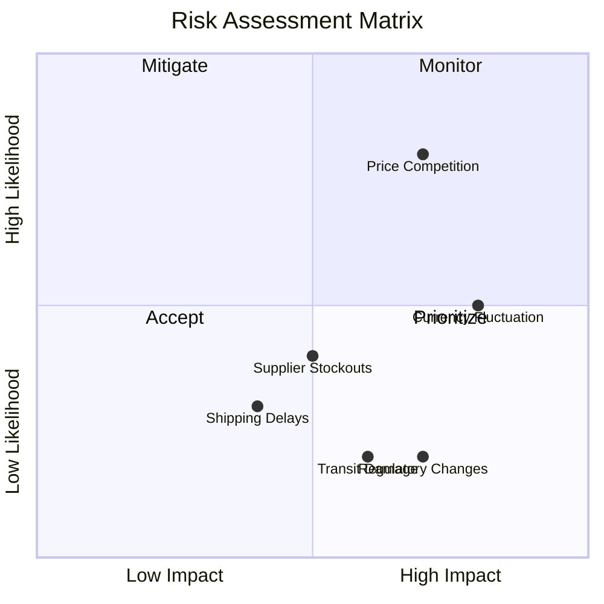

### 8.2 Risk Mitigation Strategies

| Risk                     | Likelihood | Impact | Mitigation                                                                                                                                                                               |
| ------------------------ | ---------- | ------ | ---------------------------------------------------------------------------------------------------------------------------------------------------------------------------------------- |
| **Price Competition**    | High       | High   | Differentiate on service, not price alone                                                                                                                                                |
| **Currency Fluctuation** | Medium     | High¹  | 10-15% pricing buffer; quarterly price adjustments; monitor KES/USD thresholds for real-time repricing; explore USD hedging instruments; seek suppliers accepting alternative currencies |
| **Supplier Stockouts**   | Medium     | Medium | Source from 3+ suppliers                                                                                                                                                                 |
| **Shipping Delays**      | Low        | Medium | Set realistic expectations, backup carrier                                                                                                                                               |
| **Transit Damage**       | Low        | High   | Inspect all units, file claims, insurance                                                                                                                                                |
| **Regulatory Changes**   | Low        | High   | Monitor KEBS, maintain documentation                                                                                                                                                     |

> ¹ **Currency Risk Note:** 100% of COGS is denominated in USD, representing ~60% of revenue. A 10% USD/KES depreciation erodes gross margin by ~6 percentage points. This justifies "High" impact classification.

#### Currency Management Protocol

All pricing tables and landed-cost calculations use a **KES 130/USD baseline** (rate as of 2026-02-07).

| Action                       | Frequency      | Detail                                                                                                                                                   |
| ---------------------------- | -------------- | -------------------------------------------------------------------------------------------------------------------------------------------------------- |
| **Monitor USD/KES rate**     | Weekly         | Track spot rate against the KES 130/USD baseline                                                                                                         |
| **Repricing trigger**        | On breach      | If spot rate moves **>5%** from baseline (i.e., above ~KES 136.5 or below ~KES 123.5), update all pricing tables and landed-cost figures within 48 hours |
| **Notify pending preorders** | On trigger     | Contact customers with outstanding preorders to confirm revised pricing or offer cancellation with full deposit refund                                   |
| **Quarterly review**         | Every 3 months | Review USD/KES trend even if trigger has not fired; rebase the baseline rate if the market has shifted structurally                                      |
| **Update baseline**          | After rebase   | Record new baseline rate and date in the pricing footnote (Section 3.4) and this protocol                                                                |

> ⚠️ **Cross-reference:** The pricing table footnote (Section 3.4) states the current baseline rate and date. When a repricing trigger fires or a quarterly rebase occurs, update that footnote and re-derive landed costs accordingly.

---

## 9. Implementation Timeline

### 9.1 Gantt Chart

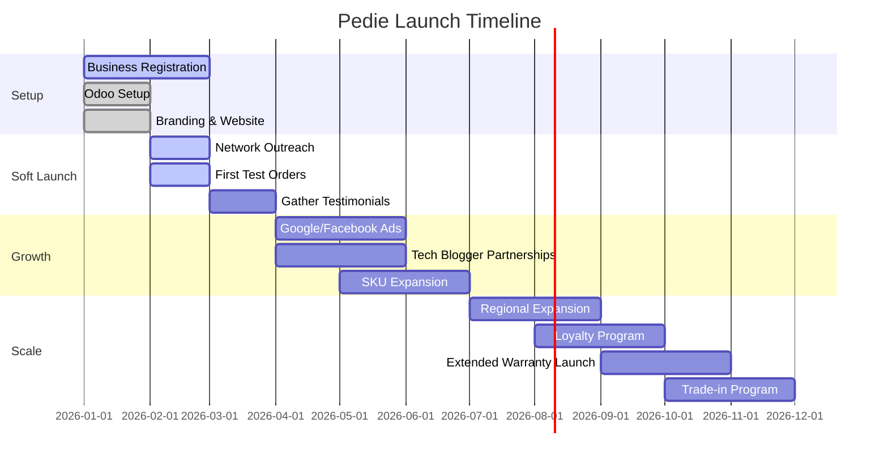

### 9.2 Monthly Milestones

| Month     | Milestone                                  | Target         |
| --------- | ------------------------------------------ | -------------- |
| **1**     | Setup complete, first test order           | 2-3 sales      |
| **2**     | Testimonials collected, WhatsApp marketing | 5-8 sales      |
| **3**     | Social media presence, referral program    | 10-15 sales    |
| **4**     | Google Ads launched                        | 15-20 sales    |
| **5**     | Tech blogger reviews published             | 20-25 sales    |
| **6**     | SKU expansion (Samsung, iPad)              | 25-30 sales    |
| **7-9**   | Regional pop-ups (Mombasa, Kisumu)         | 30-40 sales/mo |
| **10-12** | Loyalty program, trade-in launch           | 40-50 sales/mo |

---

## 10. Management & Organization

### 10.1 Organizational Structure (Year 1)

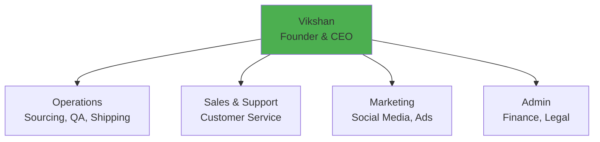

> **Note:** Year 1 is a solo operation. As volume grows, roles will be delegated.

### 10.2 Future Team (Year 2+)

| Role                     | Responsibilities                     | Hire When        |
| ------------------------ | ------------------------------------ | ---------------- |
| **Operations Assistant** | QA, packaging, delivery coordination | 50+ units/month  |
| **Customer Support**     | WhatsApp, email, disputes            | 100+ units/month |
| **Marketing Specialist** | Social media, ads, content           | 150+ units/month |

### 10.3 Key Success Factors

1. **🔍 Quality Focus** — Every unit personally inspected
2. **💬 Transparent Communication** — Honest about delays and conditions
3. **🤝 Customer Relationships** — Build loyalty, not one-time sales
4. **💰 Pricing Discipline** — Fair margins, resist race-to-bottom
5. **📊 Feedback Loop** — Adjust based on customer input
6. **⚡ Professional Service** — Prompt responses, fair warranty handling

---

## 11. Funding Request

> 📝 **Note:** This section is included for completeness. Pedie is currently bootstrapped with minimal capital requirements due to the preorder model.

### 11.1 Current Status

- **Funding Required:** KES 325,000 (startup costs) + working capital
- **Funding Source:** Personal savings / bootstrapped
- **External Investment:** Not seeking at this stage

**Working Capital Requirements (Realistic Assessment):**

| Assumption              | Value                  |
| ----------------------- | ---------------------- |
| Tiered deposits         | Phones 5%, laptops 10% |
| Blended avg landed cost | KES 45,000             |
| Blended avg deposit     | ~KES 4,900             |
| Deposit coverage        | ~10.9% of landed cost  |
| Pedie fronts per unit   | ~KES 40,100            |

_Note: Avg. landed cost is a planning-weighted average based on the Q1 mix, with phones skewed toward iPhone 11 (KES 30,370) and iPhone 12 (KES 36,870) landed costs and laptops skewed toward MacBook Air M1 landed cost (KES 95,420) from Section 3.4._

| Quarter | Units | Working Capital Needed      | Cumulative                                       |
| ------- | ----- | --------------------------- | ------------------------------------------------ |
| Q1      | 38    | KES 1.52M (38 × KES 40,100) | KES 1.52M                                        |
| Q2      | 62    | KES 2.49M (62 × KES 40,100) | Additional ~KES 0.97M beyond Q1 profits required |

> ⚠️ **Gap Analysis:** The KES 325,000 startup budget covers operational setup but not full Q1 working capital. Mitigation:
>
> - Start with 3-5 units, scale as profits reinvest (~4-6 weeks per cycle)
> - Seek short-term trade financing (family/friends or bank overdraft)
> - Apply tiered deposit policy per Section 7.1 (10% for items ≥ KES 70,000 like MacBooks)

### 11.2 Future Funding Scenarios

| Stage                  | Trigger                    | Use of Funds                    |
| ---------------------- | -------------------------- | ------------------------------- |
| **Pre-stocking**       | 50+ units/month consistent | KES 500k for inventory buffer   |
| **Team Expansion**     | 100+ units/month           | KES 300k for first hire         |
| **Regional Expansion** | Year 2                     | KES 1M for logistics, marketing |

### 11.3 Exit Strategy

> 📝 **Note:** Long-term vision, not immediate priority.

- **Option 1:** Continue as lifestyle business (35%+ margins)
- **Option 2:** Acquisition by larger retailer (Badili, Jumia)
- **Option 3:** Franchise model for regional expansion
- **Option 4:** Pivot to B2B (corporate refurbished device contracts)

---

## 12. Appendix

### A. Competitor Pricing Comparison

| Product           | Badili      | Phone Place | Grey Market | Pedie           | Pedie Advantage                           |
| ----------------- | ----------- | ----------- | ----------- | --------------- | ----------------------------------------- |
| iPhone 11 (64GB)  | KES 48,000  | KES 45,000  | KES 35,000  | **KES 40,000**  | 17% below Badili                          |
| iPhone 12 (128GB) | KES 58,000  | KES 55,000  | KES 42,000  | **KES 50,000**  | 14% below Badili                          |
| iPhone 12 Pro Max | KES 65,000  | KES 58,500  | KES 45,000  | **KES 58,000**  | 11% below Badili (overall range ~11–17%). |
| iPhone 13 Pro     | KES 78,000  | KES 72,000  | KES 55,000  | **KES 68,000**  | 13% below Badili                          |
| MacBook Air M1    | KES 145,000 | KES 135,000 | KES 100,000 | **KES 120,000** | 17% below Badili                          |

### B. Supplier Comparison

| Supplier           | Avg. Price | Quality    | Shipping | Buyer Protection | Best For    |
| ------------------ | ---------- | ---------- | -------- | ---------------- | ----------- |
| **Swappa**         | Lowest     | ⭐⭐⭐⭐   | Free US  | ⭐⭐⭐⭐⭐       | iPhones     |
| **Reebelo**        | Medium     | ⭐⭐⭐⭐⭐ | Free US  | ⭐⭐⭐⭐⭐       | MacBooks    |
| **Back Market**    | Highest    | ⭐⭐⭐⭐   | Free US  | ⭐⭐⭐⭐         | Variety     |
| **Amazon Renewed** | Medium     | ⭐⭐⭐⭐   | Prime    | ⭐⭐⭐⭐⭐       | Bulk orders |

> 📊 **See Section 3.4** for detailed supplier cost sensitivity analysis showing margin impact by supplier (Swappa 25%, Reebelo 19%, Back Market 16%).

### C. Quality Assurance Rejection Criteria

| Issue                                 | Action                     |
| ------------------------------------- | -------------------------- |
| Battery health <70%                   | Reject, return to supplier |
| Screen defects (dead pixels, burn-in) | Reject                     |
| Non-functional buttons                | Reject                     |
| Water damage indicators               | Reject                     |
| Cracked screen/body                   | Reject                     |
| Face ID / Touch ID failure            | Reject                     |
| Minor scratches (disclosed)           | Accept, note in listing    |
| Light cosmetic wear                   | Accept, note as "Grade B"  |

### D. Key Contacts & Resources

| Category      | Resource                                              |
| ------------- | ----------------------------------------------------- |
| **Shipping**  | Aquantuo Kenya — [aquantuo.com](https://aquantuo.com) |
| **Payments**  | M-Pesa Business — Safaricom                           |
| **Legal**     | _TBD — Consult accountant for registration_           |
| **Insurance** | _TBD — Product liability provider_                    |
| **Platform**  | Odoo eCommerce — [pedie.tech](https://pedie.tech)     |

---

## 📝 Document Notes

> **Missing Section Identified:**
>
> This business plan follows the SBA (Small Business Administration) traditional format. One commonly included section that could be added in future revisions:
>
> - **Social Impact / Sustainability:** How does Pedie contribute to sustainability (refurbished = reduced e-waste)? This could be a marketing angle worth developing.

---

<div align="center">

**Document Version:** 2.0  
**Last Updated:** February 4, 2026  
**Author:** Vikshan  
**Status:** ✅ Ready for Execution

---

_Pedie — Your Trusted Tech Peddler_

</div>
